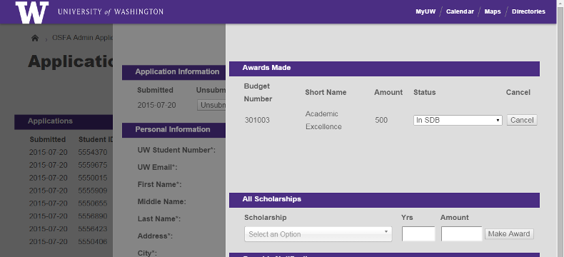

# Boundless

University of Washington `Boundless` themes for the [Framework](https://github.com/UWEnrollmentManagement/Framework) web framework.

<br>

*Attractive, easy on-brand pages for* Framework *using these Boundless theme templates.*

## Use

These templates are for the [Framework](https://github.com/UWEnrollmentManagement/Framework) web framework. You must be using *Framework* to use these templates. If you have found this page but are not using *Framework*, you may instead be looking for the Boundless [WordPress templates](https://github.com/uweb/uw-2014) or the Boundless [web templates](https://www.washington.edu/brand/web/).

The following steps are described in the *Framework* [application creation tutorial](https://github.com/UWEnrollmentManagement/Framework/blob/master/doc/application-creation.md). If you are new to *Framework*, you may wish to use that tutorial instead.

1. Add Boundless to the package requirements in your `composer.json`:

  ```
  "require": {
        ...
        "uwdoem/boundless": "0.*",
        ...
  },
  ```

2. Add the Boundless templates in your project's `setup.php`, **above** the line that adds your project-templates:
  ```
  Settings::addTemplateDirectory(dirname(__FILE__) ."/vendor/uwdoem/boundless/templates");
  Settings::addTemplateDirectory(dirname(__FILE__) ."/project-templates");
  ```
  
That's it. Your *Framework* project is now on brand!


## License

Because this repository contains significant Unviersity of Washington trademark elements, it is NOT licensed for reuse by any party who is not licensed to present University of Washington trademark elements. See the University of Washington [Trademarks & Licensing group webpage](https://www.washington.edu/trademarks/) for more information.
